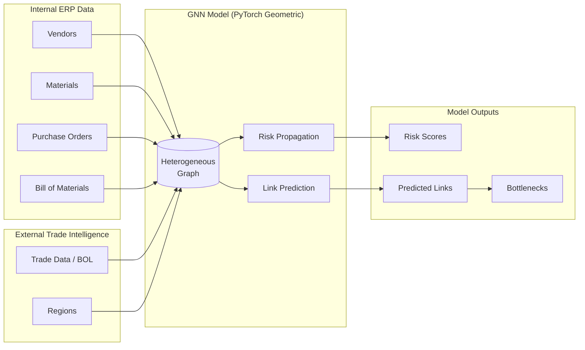
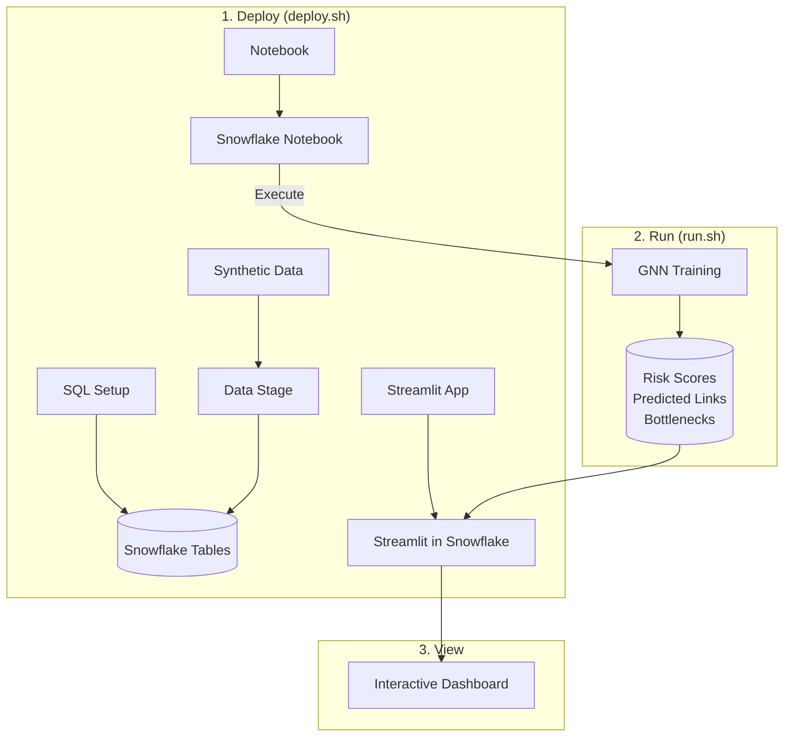

# GNN Supply Chain Risk Analysis

**AI-Driven N-Tier Supply Chain Resilience using Graph Neural Networks on Snowflake**

[](LICENSE)
[](https://www.snowflake.com/)
[](https://pytorch-geometric.readthedocs.io/)

---

## Table of Contents

- [The Business Problem](#the-business-problem)
- [The Solution](#the-solution)
- [Architecture](#architecture)
- [Prerequisites](#prerequisites)
- [Repository Structure](#repository-structure)
- [Deployment](#deployment)
- [Running the Demo](#running-the-demo)
- [Creating Demo Users](#creating-demo-users)
- [Cleanup](#cleanup)
- [License](#license)

---

## The Business Problem

### The Illusion of Diversity & Tier-N Blindness

Modern supply chains are brittle because visibility typically ends at "Tier 1"—the direct suppliers. A manufacturing company might believe its supply chain is resilient because it sources a critical component from three different vendors across three different countries. However, they lack the visibility to see that **all three vendors unknowingly source their raw materials from the same single refinery** in a geologically unstable region.

This "Tier-N Blindness" means that risks—whether geopolitical, environmental, or financial—fester unseen in the deeper layers of the network. When a disruption occurs at Tier 3, the manufacturer is blindsided weeks later by sudden shortages, leaving no time to qualify alternative sources.

### Expected Outcomes

| Capability | Description |
|------------|-------------|
| **Predictive Risk Scoring** | Alerts for *latent risks*, not just late shipments (e.g., "Part X has 75% risk because its Tier-2 source is in a sanction zone") |
| **Single Point of Failure Discovery** | Automatic detection of hidden bottlenecks where multiple Tier-1 suppliers converge on a single Tier-2+ source |
| **Proactive Qualification** | Identify and qualify backup suppliers months before a crisis occurs |

---

## The Solution

### Probabilistic Graph Intelligence

We model the entire supply ecosystem as a **Knowledge Graph**—a mathematical structure of nodes (suppliers, parts, regions) and edges (transactions, dependencies). Using **Graph Neural Networks (GNNs)**, specifically PyTorch Geometric (PyG), we:

1. **Map what we know** from internal ERP data (Tier-1 relationships)
2. **Infer what we don't know** by analyzing patterns in global trade data
3. **Propagate risk** through the network to calculate failure probabilities



---

## Architecture

### Data Flow



### Technology Stack

| Component | Technology |
|-----------|------------|
| **Data Platform** | Snowflake |
| **ML Runtime** | Snowflake Notebooks with GPU (SPCS) |
| **Graph ML** | PyTorch Geometric (GraphSAGE) |
| **Visualization** | Streamlit in Snowflake + Plotly |
| **Orchestration** | Snowflake CLI (`snow`) |

---

## Prerequisites

### Snowflake Account Requirements

- **Snowflake Account** with ACCOUNTADMIN access (for initial setup)
- **Snowpark Container Services** enabled (for GPU notebooks)
- **Cortex LLM** access (optional, for AI-assisted analysis)

### Local Development Tools

```bash
# Install Snowflake CLI
pip install snowflake-cli

# Verify installation
snow --version

# Configure connection (run once)
snow connection add
```

### Snowflake CLI Connection

Ensure you have a connection configured (default name: `demo`):

```bash
# Test your connection
snow connection test -c demo
```

---

## Repository Structure

```
gnn_supply_chain_risk/
├── deploy.sh                 # One-time deployment script
├── run.sh                    # Runtime operations (execute notebook, status, URLs)
├── clean.sh                  # Teardown script (removes all resources)
├── create_user.sh            # Create demo users with project access
│
├── sql/
│   ├── 01_account_setup.sql  # Account-level resources (role, warehouse, compute pool)
│   └── 02_schema_setup.sql   # Schema-level resources (tables, stages, views)
│
├── notebooks/
│   ├── gnn_supply_chain_risk.ipynb  # GNN training notebook (PyTorch Geometric)
│   └── environment.yml              # Notebook conda environment
│
├── streamlit/
│   ├── snowflake.yml         # Streamlit deployment config
│   ├── environment.yml       # Streamlit conda environment
│   ├── streamlit_app.py      # Main dashboard (Home page)
│   ├── pages/                # Multi-page app
│   │   ├── 1_About.py
│   │   ├── 2_Exploratory_Analysis.py
│   │   ├── 3_Supply_Network.py
│   │   ├── 4_Tier2_Analysis.py
│   │   └── 5_Risk_Mitigation.py
│   ├── utils/                # Shared utilities
│   └── components/           # Custom visualization components
│
├── data/synthetic/           # Pre-generated demo data (deterministic)
│   ├── vendors.csv
│   ├── materials.csv
│   ├── bill_of_materials.csv
│   ├── purchase_orders.csv
│   ├── trade_data.csv
│   └── regions.csv
│
├── utils/
│   └── generate_synthetic_data.py  # Data generation script (already run)
│
├── DRD.md                    # Demo Requirements Document (design reference)
├── LICENSE                   # MIT License
└── README.md                 # This file
```

---

## Deployment

### Quick Start

```bash
# Clone the repository
git clone <repository-url>
cd gnn_supply_chain_risk

# Deploy to Snowflake (creates all resources)
./deploy.sh

# Or with a specific connection
./deploy.sh -c my_connection
```

### Deployment Options

```bash
# Full deployment (default)
./deploy.sh

# Use a specific Snowflake CLI connection
./deploy.sh -c prod

# Deploy with environment prefix (e.g., DEV_GNN_SUPPLY_CHAIN_RISK)
./deploy.sh --prefix DEV

# Skip notebook deployment
./deploy.sh --skip-notebook

# Deploy only specific components
./deploy.sh --only-streamlit   # Redeploy Streamlit app only
./deploy.sh --only-notebook    # Redeploy notebook only
./deploy.sh --only-data        # Reload data only
./deploy.sh --only-sql         # Run SQL setup only
```

### What Gets Created

| Resource | Name | Description |
|----------|------|-------------|
| **Database** | `GNN_SUPPLY_CHAIN_RISK` | Contains all project objects |
| **Schema** | `GNN_SUPPLY_CHAIN_RISK` | Tables, views, stages |
| **Role** | `GNN_SUPPLY_CHAIN_RISK_ROLE` | Project-specific role |
| **Warehouse** | `GNN_SUPPLY_CHAIN_RISK_WH` | SQL operations (SMALL) |
| **Compute Pool** | `GNN_SUPPLY_CHAIN_RISK_COMPUTE_POOL` | GPU for notebook (GPU_NV_S) |
| **Notebook** | `GNN_SUPPLY_CHAIN_RISK_NOTEBOOK` | PyTorch Geometric GNN |
| **Streamlit** | `GNN_SUPPLY_CHAIN_RISK_APP` | Interactive dashboard |

---

## Running the Demo

### Step 1: Execute the GNN Notebook

The notebook trains the Graph Neural Network and writes results to Snowflake tables:

```bash
# Execute the notebook
./run.sh main

# With environment prefix
./run.sh --prefix DEV main
```

**What happens:**
1. Loads data from Snowflake tables
2. Builds a heterogeneous graph (Vendors, Materials, Regions, External Suppliers)
3. Trains GraphSAGE model for link prediction
4. Computes risk scores for all nodes
5. Identifies bottlenecks (single points of failure)
6. Writes results to `RISK_SCORES`, `PREDICTED_LINKS`, `BOTTLENECKS` tables

### Step 2: Open the Streamlit Dashboard

```bash
# Get the Streamlit app URL
./run.sh streamlit
```

Or navigate manually in Snowsight:
1. Go to **Projects > Streamlit**
2. Open **GNN_SUPPLY_CHAIN_RISK_APP**

### Step 3: Explore the Dashboard

| Page | Description |
|------|-------------|
| **Home** | Executive summary with top concentration risk visualization |
| **About** | Technical documentation and data architecture |
| **Exploratory Analysis** | Data source coverage and visibility gap analysis |
| **Supply Network** | Interactive graph visualization of multi-tier relationships |
| **Tier-2 Analysis** | Deep dive into bottlenecks and predicted links |
| **Risk Mitigation** | Prioritized action items with AI-assisted analysis |

### Check Status

```bash
# View resource status and table counts
./run.sh status
```

---

## Creating Demo Users

Create additional users with read-only access to the demo:

```bash
# Create a demo user with temporary password
./create_user.sh \
  -u demo_user \
  -c demo \
  -d GNN_SUPPLY_CHAIN_RISK \
  -s GNN_SUPPLY_CHAIN_RISK \
  -p TempPassword123!

# With compute pool access (for notebook execution)
./create_user.sh \
  -u analyst \
  -c demo \
  -d GNN_SUPPLY_CHAIN_RISK \
  -s GNN_SUPPLY_CHAIN_RISK \
  --compute-pool GNN_SUPPLY_CHAIN_RISK_COMPUTE_POOL \
  -p TempPassword123!

# Dry run to preview SQL
./create_user.sh \
  -u test_user \
  -c demo \
  -d GNN_SUPPLY_CHAIN_RISK \
  -s GNN_SUPPLY_CHAIN_RISK \
  --dry-run
```

---

## Cleanup

Remove all project resources from Snowflake:

```bash
# Interactive cleanup (prompts for confirmation)
./clean.sh

# Force cleanup (no confirmation)
./clean.sh --force

# Cleanup prefixed environment
./clean.sh --prefix DEV --force
```

**Removed resources:**
- Compute Pool
- Warehouse
- Database (cascades to all tables, views, stages, notebooks, Streamlit apps)
- Role
- Network Rules and External Access Integration

---

## Data Model

### Input Tables (ERP + Trade Data)

| Table | Description | Source |
|-------|-------------|--------|
| `VENDORS` | Tier-1 supplier master data | ERP (SAP LFA1) |
| `MATERIALS` | Parts/products catalog | ERP (SAP MARA) |
| `PURCHASE_ORDERS` | Supplier-to-material transactions | ERP (SAP EKPO) |
| `BILL_OF_MATERIALS` | Component hierarchy | ERP (SAP STPO) |
| `TRADE_DATA` | Bills of lading / shipping records | External |
| `REGIONS` | Geographic risk factors | External |

### Output Tables (GNN Results)

| Table | Description |
|-------|-------------|
| `RISK_SCORES` | Propagated risk scores with categories (LOW/MEDIUM/HIGH/CRITICAL) |
| `PREDICTED_LINKS` | Inferred Tier-2+ relationships with probability scores |
| `BOTTLENECKS` | Single points of failure with impact scores |

---

## Troubleshooting

### Connection Issues

```bash
# Test Snowflake connection
snow connection test -c demo

# For JWT authentication, set passphrase
export SNOWFLAKE_PRIVATE_KEY_PASSPHRASE='your_passphrase'
```

### Compute Pool Not Starting

```bash
# Check compute pool status
snow sql -c demo -q "SHOW COMPUTE POOLS LIKE 'GNN_SUPPLY_CHAIN_RISK%';"

# Compute pools may take 2-5 minutes to start on first use
```

### Notebook Execution Fails

1. Ensure compute pool is running (check status in Snowsight)
2. Verify external access integration is created (for PyPI access)
3. Check notebook logs in Snowsight for detailed errors

### Streamlit App Not Loading

```bash
# Redeploy the Streamlit app
./deploy.sh --only-streamlit
```

---

## License

This project is licensed under the MIT License - see the [LICENSE](LICENSE) file for details.

---

## Acknowledgments

- **PyTorch Geometric** - Graph Neural Network library
- **Snowflake** - Data Cloud platform
- **GraphSAGE** - Inductive representation learning on large graphs

---

<p align="center">
  Built with ❄️ Snowflake &nbsp;|&nbsp; 🔗 PyTorch Geometric &nbsp;|&nbsp; 🎨 Streamlit
</p>
