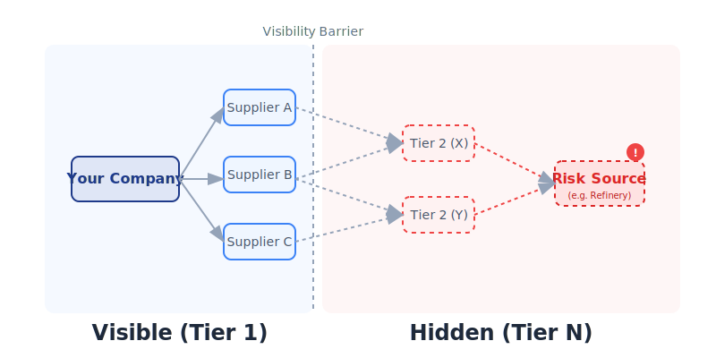
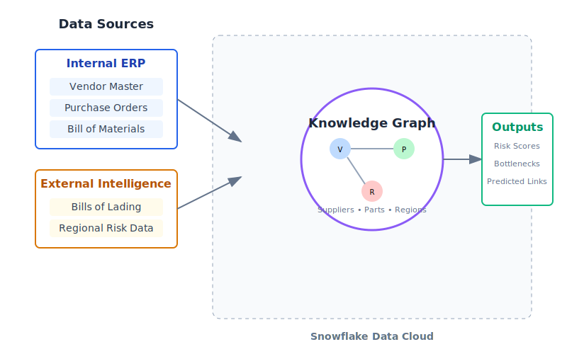
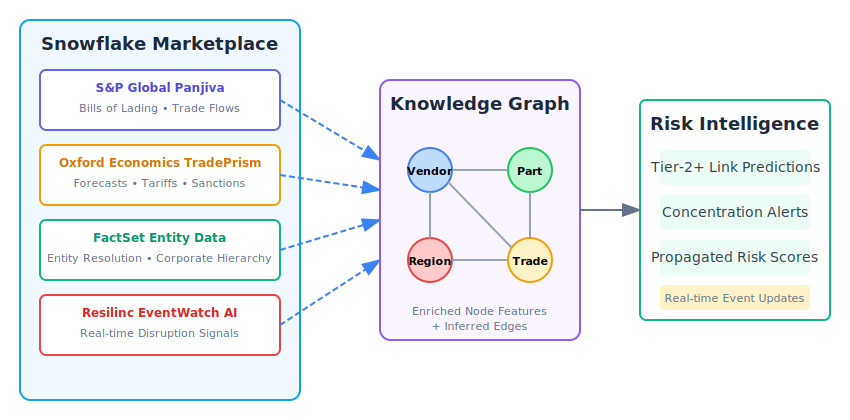
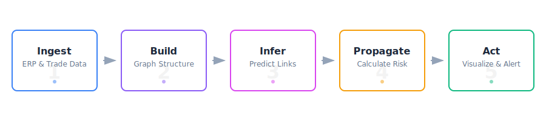
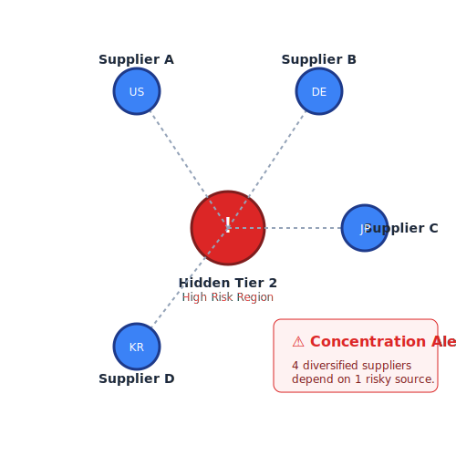
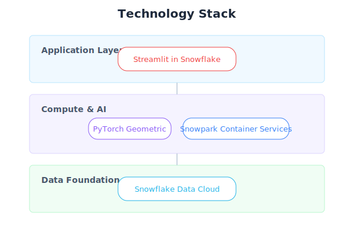

# Supply Chain Risk Intelligence for Manufacturing: Achieve N-Tier Visibility with Snowflake

**Uncover hidden supplier dependencies and concentration risks before they disrupt your production.**

---

## The Problem in Context

Procurement and supply chain teams believe they have diversified sourcing because their ERP shows multiple Tier-1 suppliers across different countries. But that data is incomplete—visibility ends at the first tier.

- **Tier-N blindness costs time and money.** When a disruption occurs at Tier-3, you're blindsided weeks later by sudden shortages, leaving no time to qualify alternatives.

- **Single points of failure hide in plain sight.** Three Tier-1 vendors across three countries may unknowingly source raw materials from the same refinery in a geologically unstable region.

- **Reactive firefighting replaces strategic planning.** Without predictive risk signals, procurement teams spend time managing crises instead of building resilient supply networks.

- **Compliance and audit gaps create exposure.** Regulations like UFLPA require traceability beyond Tier-1, but current systems cannot provide that visibility.


*Traditional ERP visibility ends at Tier-1. Risks fester unseen in deeper layers of the supply network.*

---

## What We'll Achieve

This solution transforms supply chain management from reactive response to proactive resilience.

- **Predictive risk scoring.** Alerts for latent risks before they manifest—"Part X has a 75% risk score because its estimated Tier-2 source is in a sanction zone."

- **Automatic concentration discovery.** Identify hidden bottlenecks where multiple Tier-1 suppliers converge on the same Tier-2+ source.

- **Proactive supplier qualification.** Find and qualify backup suppliers months before a crisis, not during one.

- **Faster time to insight.** Reduce supply chain due diligence from weeks of manual research to minutes of AI-powered analysis.

---

## Why Snowflake

- **Unified data foundation.** Internal ERP data and external trade intelligence join seamlessly in a governed platform—no data movement, no pipeline complexity.

- **Performance that scales.** GPU-enabled notebooks train graph neural networks on millions of trade records without infrastructure friction.

- **Collaboration without compromise.** Share risk insights with sourcing partners and internal teams while maintaining data governance and access controls.

- **Built-in AI/ML and apps.** From PyTorch Geometric models to interactive Streamlit dashboards, build and deploy intelligence closer to where decisions happen.

---

## The Data (At a Glance)

The solution fuses internal ERP data with external trade intelligence into a knowledge graph that reveals what your ERP cannot see.


*Internal ERP data forms the backbone; external trade intelligence fills in the hidden Tier-2+ relationships.*

- **Domains:** Vendors (Tier-1 suppliers), Materials (parts and BOMs), Regions (geographic risk factors), Trade Data (bills of lading linking shippers to consignees).
- **Freshness:** Batch ingestion for ERP data; continuous refresh for trade intelligence via Snowflake Marketplace.
- **Trust:** All data stays within Snowflake's governance boundary with role-based access controls.

| Data Source | Type | Purpose |
|-------------|------|---------|
| Vendor Master (ERP) | Internal | Known Tier-1 supplier nodes |
| Purchase Orders (ERP) | Internal | Supplier-to-material transaction edges |
| Bill of Materials (ERP) | Internal | Product assembly hierarchy |
| Trade Data (External) | Enrichment | Hidden Tier-2+ relationship inference |
| Regional Risk (External) | Enrichment | Geopolitical and disaster risk factors |

See [Snowflake Marketplace: Real-World Data Integration](#snowflake-marketplace-real-world-data-integration) for production data providers.

---

## Snowflake Marketplace: Real-World Data Integration

Moving from demo to production requires high-quality external data. These **Snowflake Marketplace** providers deliver the trade intelligence and entity data needed to operationalize N-tier visibility—no data pipelines to build, no contracts to negotiate outside your Snowflake account.


*Snowflake Marketplace providers plug directly into the knowledge graph, enriching internal ERP data with global trade flows and entity relationships.*

### S&P Global Market Intelligence — Panjiva Supply Chain Intelligence

**The gold standard for inferring hidden Tier-2+ relationships.**

[Panjiva Micro](https://www.snowflake.com/datasets/sp-global-market-intelligence-panjiva-supply-chain-intelligence/) | [Panjiva Macro (UN Comtrade)](https://www.snowflake.com/datasets/sp-global-market-intelligence-panjiva-macro-un-comtrade/)

- **What it provides:** Customs-based bill-of-lading shipment records with shipper/consignee entities, HS codes, origin/destination ports, volumes, and values.
- **How we use it:** Feed shipper→consignee trade flows as edges into the GNN. When your Tier-1 supplier appears as a consignee, Panjiva reveals who shipped to them—your likely Tier-2 suppliers.
- **Key insight:** If three of your Tier-1 vendors all receive shipments from the same overseas refinery, Panjiva exposes that hidden concentration before a disruption occurs.

### Oxford Economics — TradePrism

**Forward-looking trade forecasts and scenario modeling.**

[TradePrism Full Dataset](https://app.snowflake.com/marketplace/listing/GZ1M7ZCX4H2/oxford-economics-group-tradeprism-full-dataset)

- **What it provides:** Global trade forecasts at HS4 level across ~170 economies, including tariff scenarios, sanction impacts, and trade rerouting projections.
- **How we use it:** Overlay predictive risk scores with forward-looking exposure. A supplier in a stable region today may face tariff escalation or sanctions risk tomorrow.
- **Key insight:** Combine historical Panjiva shipment data with TradePrism forecasts to answer: "If sanctions expand to Region X, which of my supply chains are exposed?"

### FactSet — Supply Chain Linkages & Entity Data

**Entity resolution and corporate relationship mapping.**

[FactSet on Snowflake Marketplace](https://app.snowflake.com/marketplace/providers/GZT0Z28ANYN/FactSet)

- **What it provides:** Company fundamentals, estimates, and supply chain linkages with standardized symbology for entity matching across datasets.
- **How we use it:** Map shipper/consignee names from trade data to actual vendor entities in your ERP. Build supplier/geo exposure roll-ups at the corporate parent level.
- **Key insight:** Your ERP shows "Acme Electronics (Shenzhen)" as a supplier. FactSet reveals it's a subsidiary of a larger conglomerate with operations across five countries—changing your geographic diversification assumptions.

### Resilinc — EventWatch AI

**Real-time disruption monitoring and supplier risk signals.**

[Resilinc EventWatch AI](https://app.snowflake.com/marketplace/listing/GZSTZO0V7VR/resilinc-eventwatch-ai)

- **What it provides:** AI-powered monitoring of global events (natural disasters, geopolitical incidents, factory fires, labor actions) mapped to supplier locations and impact zones.
- **How we use it:** Inject real-time risk signals into the propagated risk scores. When EventWatch detects a factory fire at a Tier-2 location, the GNN immediately recalculates downstream impact.
- **Key insight:** Move from periodic risk assessment to continuous monitoring. Know about disruptions hours after they happen, not weeks later when parts don't arrive.

### Data Integration Architecture

| Marketplace Provider | Graph Node/Edge Type | Integration Point |
|---------------------|---------------------|-------------------|
| **Panjiva** | Trade flow edges (shipper→consignee) | GNN link prediction training |
| **TradePrism** | Region risk attributes | Node feature enrichment |
| **FactSet** | Entity resolution, corporate hierarchy | Supplier node canonicalization |
| **Resilinc** | Real-time event signals | Dynamic risk score updates |

### Why Marketplace Data Matters

- **Zero ETL.** Data lives in Snowflake—join to your tables with SQL, no data movement required.
- **Always current.** Providers update their datasets; you automatically get fresh intelligence.
- **Governed access.** Marketplace shares respect your Snowflake RBAC; sensitive enrichments stay protected.
- **Rapid time-to-value.** Skip months of data licensing negotiations and pipeline engineering.

---

## How It Comes Together


*From raw data to actionable risk intelligence in five steps.*

1. **Ingest.** Load ERP exports (vendors, materials, purchase orders, BOMs) and external trade data into Snowflake tables. [→ SQL Setup Scripts]

2. **Build the Graph.** Construct a heterogeneous knowledge graph with suppliers, parts, and regions as nodes; transactions and trade flows as edges. [→ GNN Notebook]

3. **Infer Hidden Links.** Train a GraphSAGE model on trade patterns to predict likely Tier-2+ supplier relationships with probability scores. [→ GNN Notebook]

4. **Propagate Risk.** Calculate risk scores that flow through the network—a shock at Tier-3 propagates to impact Tier-1 and final products. [→ GNN Notebook]

5. **Visualize and Act.** Explore the supply network graph, analyze concentration points, and prioritize mitigation actions in an interactive dashboard. [→ Streamlit App]

---

## The Discovery Moment


*The "aha" moment: Three seemingly independent Tier-1 suppliers all depend on the same hidden Tier-2 refinery.*

Traditional analytics show a diversified supply base. Graph intelligence reveals the convergence.

**Before:** "We're safe—we source from three different vendors in three countries."

**After:** "All three vendors rely on one Tier-2 supplier in a high-risk region. We need to qualify alternatives now."

---

## Dashboard Experience

The Streamlit application guides users from executive summary to prioritized actions.

| View | What You See |
|------|--------------|
| **Home** | Key metrics: nodes analyzed, critical risks, bottlenecks discovered |
| **Supply Network** | Interactive graph to filter, zoom, and trace dependency paths |
| **Tier-2 Analysis** | Predicted links, probability scores, and concentration impacts |
| **Risk Mitigation** | Prioritized actions ranked by impact with AI-assisted context |


---

## Personas and Value

| Persona | Key Need | How This Solution Helps |
|---------|----------|------------------------|
| **VP of Procurement** | Reduce supplier-driven production disruptions | See concentration risks before they cause shortages; make proactive qualification investments |
| **Supply Chain Manager** | Faster risk assessment for critical materials | Propagated risk scores highlight which parts need attention—no manual tracing required |
| **Supplier Quality Engineer** | Identify high-risk suppliers for audit | Filter by risk category; prioritize reviews based on network position, not just financials |
| **Data Scientist** | Build and iterate on risk models | PyTorch Geometric runs in Snowflake Notebooks with GPU; experiment close to governed data |

---

## Technology Foundation

| Component | Role |
|-----------|------|
| **Snowflake Tables** | Store ERP data, trade intelligence, and model outputs |
| **Snowflake Notebooks (SPCS)** | Execute GNN training with GPU acceleration |
| **PyTorch Geometric** | GraphSAGE model for link prediction and risk propagation |
| **Streamlit in Snowflake** | Interactive dashboard for exploration and action planning |
| **Snowflake CLI** | Orchestrate deployment, execution, and cleanup |



---

## Call to Action

### Primary: Run the Demo in Your Account

1. Clone the repository and deploy to your Snowflake account:
   ```bash
   ./deploy.sh -c your_connection
   ```

2. Execute the GNN notebook to generate risk scores:
   ```bash
   ./run.sh main
   ```

3. Open the Streamlit dashboard:
   ```bash
   ./run.sh streamlit
   ```

### Secondary: Explore with Your Data

- Review the data architecture and map to your ERP schema
- Subscribe to Marketplace data sources for Tier-2+ enrichment:
  - [S&P Global Panjiva](https://www.snowflake.com/datasets/sp-global-market-intelligence-panjiva-supply-chain-intelligence/) — Trade flow intelligence
  - [Oxford Economics TradePrism](https://app.snowflake.com/marketplace/listing/GZ1M7ZCX4H2/) — Forward-looking trade forecasts
  - [FactSet](https://app.snowflake.com/marketplace/providers/GZT0Z28ANYN/FactSet) — Entity resolution and corporate linkages
  - [Resilinc EventWatch](https://app.snowflake.com/marketplace/listing/GZSTZO0V7VR/) — Real-time disruption monitoring
- Schedule a working session to design a proof-of-concept with your critical materials

<p align="center">
Built with ❄️ Snowflake &nbsp;|&nbsp; 🔗 PyTorch Geometric &nbsp;|&nbsp; 🎨 Streamlit
</p>

